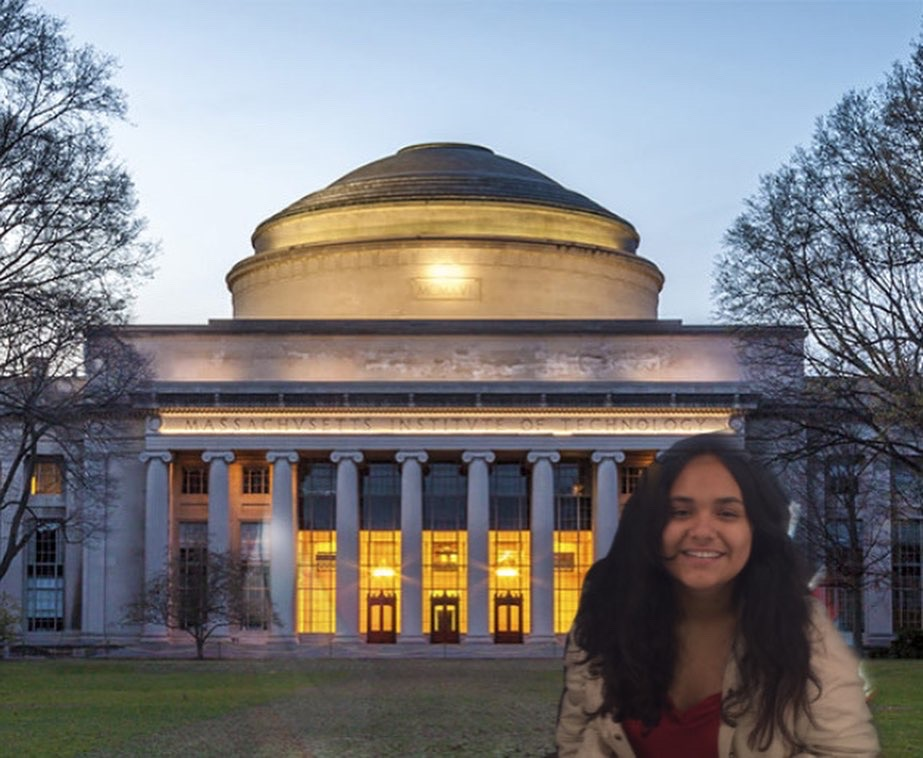

Hello and welcome to this blog. My name is Ana, a senior undergradute biomedical engineering student who is trying to be introduced to Machine Learning and Artificial Intelligence! By writing a blog I am trying to make a commitment to myself, challenge myself to publish whatever I write and (hopefully) sharing something useful. 

This one goes for the girl who once believed she could make it into big places like MIT... 

## Current goals

The whole reason I started this blog is because I was introduced to the [fast.ai](https://www.fast.ai) course by my partner (who actually knows something about ML). My current research project has allowed me the opportunity to dive deeper into the application of ML in biomedical engineering and is my main motivation to learn about these topics. 

I will attempt to write my goals and the progress will ideally be reflected in the following posts.

[**fast.ai course**](https://www.fast.ai) - 

**Neural networks and deep learning Coursera course** - 

**Learning TabNet** - 
